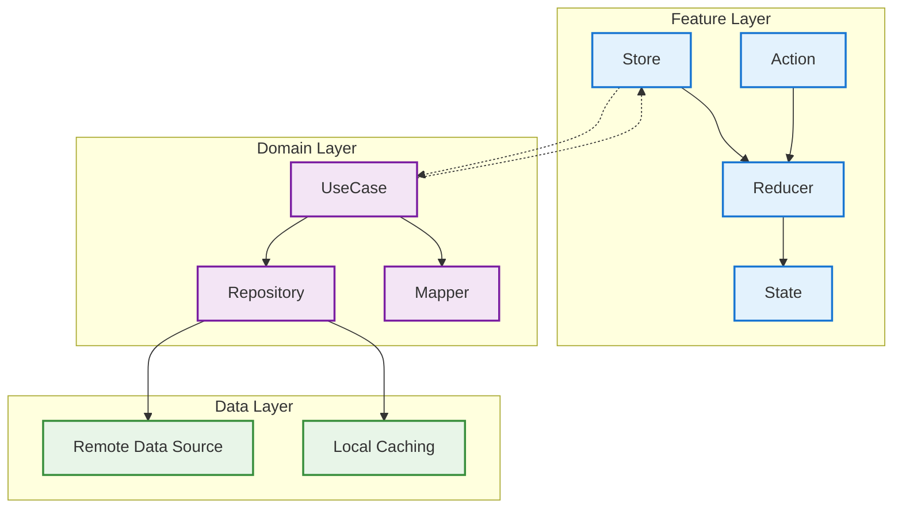

# Heroes App 📱

**Heros App** is a Swift-based iOS application built using TCA architecture. The app displays a list of Hereos with their details and allows search Heroes by their names.

---

## **Table of Contents**

1. [Introduction](#introduction)
2. [Features](#features)
3. [App Screenshots](#app-screenshots)
4. [How It Works](#how-it-works)  
   - [Main View](#1-main-view)  
   - [Hero Details](#2-hero-details)
5. [Setup & Installation](#setup--installation)
6. [Architecture Overview](#architecture-overview)  
7. [Git Workflow](#git-workflow)
8. [Modules](#modules)
9. [Diagrams](#diagrams)
10. [Key Improvements](#key-improvements)
11. [Dependencies](#dependencies)
12. [API Integration](#api-integration)  
13. [Future Enhancements](#future-enhancements)
14. [Issues](#issues)
15. [Contributing](#contributing)
16. [License](#license)

---

## **Features**
- 📜 **List of Hereos**: Displays a List of all Hereos with their name, Image, and description.
- 🔍 **Search**: Search Hereos by their names.
- 🧍‍♂️ **Hero Details**: View detailed information about a selected hero, including:
  - Name
  - Image
  - Full description
  - Comics
  - Series
  - Stories

## **App Screenshots**

| **Heroes List**  | **Hereos Details**                                                                                                                                                              
|------------------|----------------------------------------------------------------------------------------------------
|  |   

---

## **How It Works**

### **1. Main View**
The main screen is a table view displaying all heroes fetched from the API.

- Each row displays:
  - hero's name.
  - hero's image.
  - hero's short description.

### **2. Hero Details**
On selecting a hero from the list, a detail view is shown with the character's:
- Profile image.
- Name.
- Description.
- Comics.
- Series.
- Stories.

---

## **Setup & Installation**

1. **Clone the Repository**  
   ```bash
   git clone https://github.com/knight6700/WallaMarvel
   ```
2. **Install all dependancies with Gem**  
   - Open `Terminal`
   - ```cd project-path```
   - ``` chmod +x onboarding.sh ```
   - ``` \.onboarding.sh```
   - Write private and public keys Api for `Debug` and `Release`

3. **Open in Xcode**  
   - Open the `.xcodeproj`

4. **Install Dependencies**  
   - Resolve Swift Package Manager (SPM) dependencies.

5. **Run the App**  
   - Select a simulator or a connected device.
   - Click the **Run** button or press `⌘R`.
- 🔐 Note: For production builds, you can update the API keys via GitHub Secrets or your CI/CD environment. 
---

## **Architecture Overview**

The app adopts **TCA (The Composable Architecture)** to structure features in a modular, testable, and scalable way, following principles of unidirectional data flow and state management.

---

## **Git Workflow**

We use **GitFlow** to manage our development process. The main branches include:

- `main`: Production-ready code.
- `develop`: Ongoing development and integration.
- `feature/*`: New features are developed here and then merged into `develop`.
- `hotfix/*`: For urgent fixes on `main`.

### Git Workflow Summary
```text
main ← hotfix/*
↑
develop ← feature/*
```

> Always create branches from `develop` for new features and from `main` for hotfixes.

---

## **Modules**

The project is organized into multiple Swift modules to ensure separation of concerns and modular scalability:

1. **Heroes**  
   - Manages everything related to hero listing and details.
   - Includes:
     - Hero List view.
     - Hero Details view.
     - Coordinator logic for navigation between these screens.

2. **HorizonComponents**  
   - Contains all reusable UI components.
   - Encourages UI consistency and code reusability across the app.

3. **HorizonNetwork**  
   - Handles all remote API communications.
   - Includes:
     - API client.
     - Endpoint configuration.
     - Network error handling.

---

## **Diagrams**
### App Graph:

### TCA: 

[for more details](https://github.com/pointfreeco/swift-composable-architecture)

---

## **Key Improvements**
1. **Grid View or CollectionVieew**: Create a `Grid View` or `CollectionView` to efficiently display resources (e.g., comics).
2. **Encryption Module**: Implement an encryption module using the Arkana library and MD5, or any other suitable encryption technique.
3. **Network**: remore static func for remote.

---

## **Dependencies**
- [`SwiftUI`](https://developer.apple.com/tutorials/swiftui/): For building the UI.
- [`URLSession`](https://developer.apple.com/documentation/foundation/urlsession): For API communication.
- [`Kingfisher`](https://github.com/onevcat/Kingfisher): For image downloading and caching.
- [`Snapshot-Testing`](https://github.com/pointfreeco/swift-snapshot-testing): For snapshot views.
- [`Netfox`](https://github.com/kasketis/netfox): For debugging network requests.
- [`TCA Framework`](https://github.com/pointfreeco/swift-composable-architecture): A Swift framework for managing state, side effects, and app architecture in a modular and testable way
- [`IdentifiedCollections`](https://github.com/pointfreeco/swift-identified-collections): When modeling a collection of elements in your application's state, it is easy to reach for a standard Array.
- [`swift-dependencies`](https://github.com/pointfreeco/swift-dependencies):  A dependency management library inspired by SwiftUI's "environment.". 
---

## **API Integration**

The app fetches data from the **Marvel API**.

### **Endpoints**
### 🔗 Marvel API Authentication

To fetch characters from the Marvel API, use the following URL format:

```
https://gateway.marvel.com/v1/public/characters?limit={Int}&offset={Int}&ts={Int}&apikey={String}&hash={String}
```

#### 🧩 Required Parameters

| Parameter        | Description                                                                                                                             |
| ---------------- | --------------------------------------------------------------------------------------------------------------------------------------- |
| `limit`          | Number of results to return.                                                                                                            |
| `offset`         | Pagination offset.                                                                                                                      |
| `ts` (timestamp) | A unique timestamp. Usually the current time in seconds:<br>`String(Int(Date().timeIntervalSince1970))`                                 |
| `apikey`         | Your **public** API key from [Marvel Developer Portal](https://developer.marvel.com).                                                   |
| `hash`           | An MD5 hash of: <br>`timestamp + privateKey + publicKey`<br>For example:<br>`"\(timestamp)\(privateKey)\(publicKey)"` hashed using MD5. |
| `privateKey`     | Your **private** API key (keep this secret). Available after registering on Marvel Developer Portal.                                    |
| `name` (Optional)     | Name of the hero you want to search for.                                    |

#### 🔐 Hash Generation (Swift Example)

```swift
let timestamp = String(Int(Date().timeIntervalSince1970))
let input = "\(timestamp)\(privateKey)\(publicKey)"
let hash = input.md5() // Use an MD5 hashing function
```

> ✅ The `hash` is required for authenticating API requests and must be computed for every call.

1. **Fetch All Characters**  
   - URL: `https://gateway.marvel.com/v1/public/characters?limit={Int}&offset={Int}&ts={Int}&apikey={String}&hash={String}`
2. **Character Search**  
   - URL: `https://gateway.marvel.com/v1/public/characters?limit={Int}&offset={Int}&ts={Int}&apikey={String}&hash={String}&name={String}`
3. **Fetch Resources**  
   - URL: `https://gateway.marvel.com/v1/public/characters/{character_Id}/{resourceType}?limit={Int}&offset={Int}&ts={Int}&apikey={String}&hash={String}`
   - Resource Type:  `comics`, `series`, or `stories`.  

---

## **Future Enhancements**
- 🌎 **Connectivity Check**: Show a "No Internet" alert automatically when the device is offline.
- 🔥 **Caching**: Implement API caching using an appropriate technique to improve performance and reduce network usage.
- 📊 **Statistics**: Displays statistics for the heroes fetched through the details and search features.

---

## **Issues**
- [Duplicated Id](https://github.com/knight6700/WallaMarvel/issues/6):
 The API was returning duplicate heroes with the same ID, so we resolved it by using a unique id (generated with UUID().uuidString) alongside the original heroId (Int) from the API.

---

## **Contributing**

Contributions are welcome! Follow these steps to contribute:
1. Fork the repository.
2. Create a feature branch:  
   ```bash
   git checkout -b feature-branch
   ```
3. Commit your changes:  
   ```bash
   git commit -m "Add new feature"
   ```
4. Push to the branch:  
   ```bash
   git push origin feature-branch
   ```
5. Create a pull request.

---

## **License**

This project is licensed under the **MIT License**. See the [LICENSE](LICENSE) file for more details.
---
